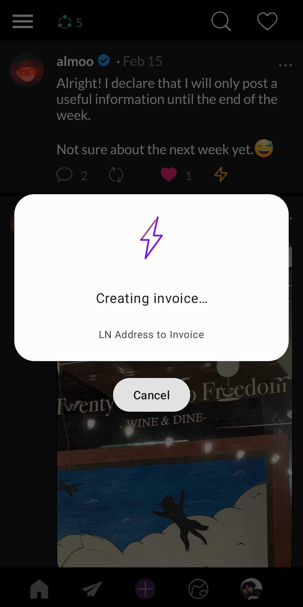
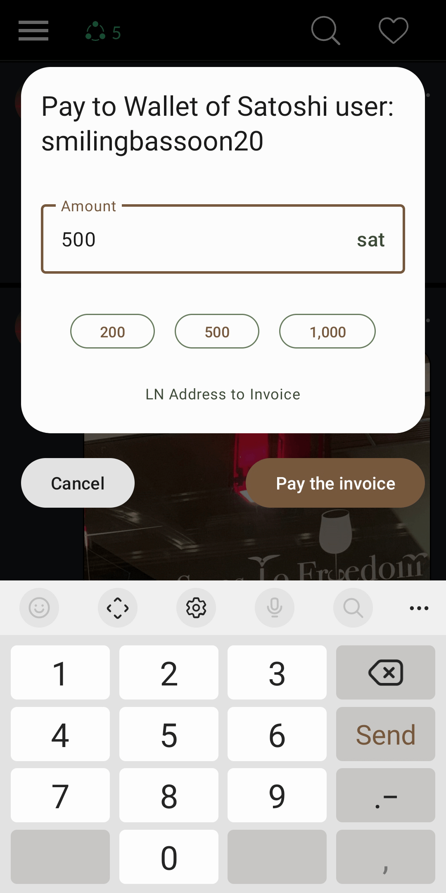
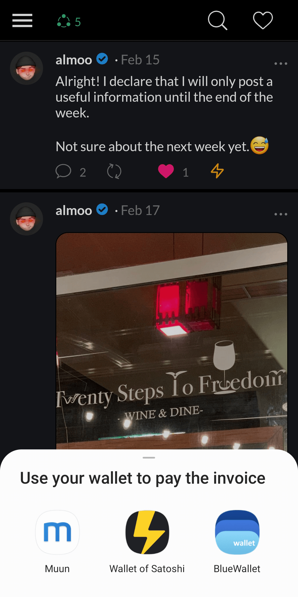

#  LN Address to Invoice
Some popular Bitcoin Lightning wallets, like Muun or Blue Wallet, don't support email-like Lightning addresses. This app allows paying to such addresses by turning them to convenient invoices. For me, it is helpful when zapping and tipping in Nostr.

## How to use
To use the app, click on the Lightning address link (like tip or zap in Nostr) and select "LN Address to Invoice" app. Follow the instructions and then pay the invoice with your favorite wallet. 

▶ [Demo video (YouTube)](https://www.youtube.com/shorts/FMpSQ-l64Cw)

The app doesn't add any extra fee to your payment.

## Download
[ APK from the latest release](https://github.com/Radiokot/ln-addr-to-invoice/releases/latest)

[ F-Droid](https://f-droid.org/packages/ua.com.radiokot.lnaddr2invoice)

[ Google Play](https://play.google.com/store/apps/details?id=ua.com.radiokot.lnaddr2invoice)

## License
I reject the concept of intellectual property. Claiming ownership over information that can be replicated perfectly and endlessly is inherently flawed. Consequently, any efforts to uphold such form of ownership inevitably result in some people gaining unjustifiable control over other's tangible resources, such as computers, printing equipment, construction materials, etc. [1](repository-assets/kinsella_against_intellectual_property.pdf)
When talking specifically about source code licensing – without a state violently enforcing [copyright monopolies](https://torrentfreak.com/language-matters-framing-the-copyright-monopoly-so-we-can-keep-our-liberties-130714/), it would be ludicrous to assume that a mere text file in a directory enables someone to restrict processing copies of this information by others on their very own computers. 
However, there is [such a file](LICENSE) in this repository bearing the GPLv3 license. Why?

One would expect someone with such an attitude to not use the license at all, use a permissive license, or [explicitly unlicense](https://unlicense.org/).
But for me, to do so is to voluntarily limit my means of defense. To act as a gentleman with those who readily exploit state violence against you is to lose.
In a world where copyright monopolies are violently enforced, I choose GPLv3 for the software I really care for, because under the current circumstances this license is a tool that:
- Allows **others** to freely use, modify and distribute this software, without the risk of being sued;
- Enables **me** to pull all the valuable changes from public forks back to the trunk, also without the risk of being sued;
- **Knocks down a peg** individuals or companies willing to monopolize their use case or modifications of this software.

## Tech stack
- Kotlin
- RxJava
- Koin dependency injection
- ViewModel
- kotlin-logging with slf4j-handroid

---
⚡ [Send me a tip](https://radiokot.com.ua/tip)

🟣 Follow me on Nostr: `npub12358n500vfnf9j522nueg05k9yvhh97936smfgat6mledzegp5yskzrjdj`
