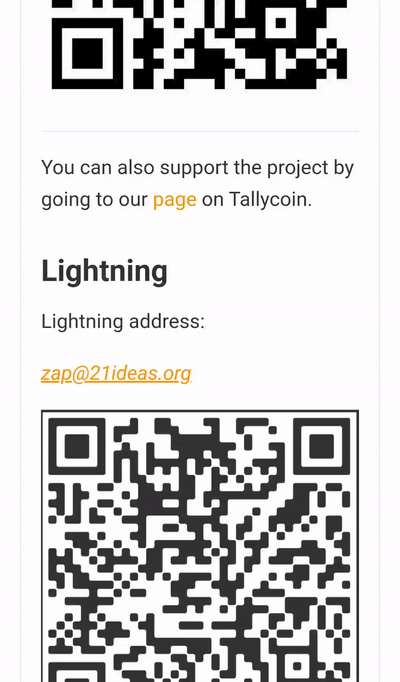

#  LN Address to Invoice
Some popular Bitcoin Lightning wallets, like Muun or Blue Wallet, don't support email-like Lightning addresses. This app allows paying to such addresses by turning them to convenient invoices. For me, it is helpful when zapping and tipping in Nostr.

The app doesn't add any extra fee to your payment.

## How to use
This utility is launched when you interact with addresses in your browser or other apps. Here's how it is done.

### Clicking an address
Sometimes, a Lightning address is a clickable link, just like an email. When you click it, LN Address to Invoice appears.

### Selecting an address
Often a Lightning address is just a text. In this case, select it and in the appeared system menu look for the **Send sats** action.

### Copy-pasting an address
If you see a Lightning address which is neither clickable nor selectable, or the presenting app doesn't support selection actions, just copy the address from there and paste into LN Address to Invoice with the Paste button in the header of the intro screen, or with the **Paste address** launcher icon shortcut.

## Download
[ APK from the latest release](https://github.com/Radiokot/ln-addr-to-invoice/releases/latest)

[ F-Droid](https://f-droid.org/packages/ua.com.radiokot.lnaddr2invoice)

[ Google Play](https://play.google.com/store/apps/details?id=ua.com.radiokot.lnaddr2invoice)

## License
I reject the concept of intellectual property. Claiming ownership over information that can be replicated perfectly and endlessly is inherently flawed. Consequently, any efforts to uphold such form of ownership inevitably result in some people gaining unjustifiable control over other's tangible resources, such as computers, printing equipment, construction materials, etc. [1](repository-assets/kinsella_against_intellectual_property.pdf)
When talking specifically about source code licensing – without a state violently enforcing [copyright monopolies](https://torrentfreak.com/language-matters-framing-the-copyright-monopoly-so-we-can-keep-our-liberties-130714/), it would be ludicrous to assume that a mere text file in a directory enables someone to restrict processing copies of this information by others on their very own computers. 
However, there is [such a file](LICENSE) in this repository bearing the GPLv3 license. Why?

One would expect someone with such an attitude to not use the license at all, use a permissive license, or [explicitly unlicense](https://unlicense.org/).
But for me, to do so is to voluntarily limit my means of defense. To act as a gentleman with those who readily exploit state violence against you is to lose.
In a world where copyright monopolies are violently enforced, I choose GPLv3 for the software I really care for, because under the current circumstances this license is a tool that:
- Allows **others** to freely use, modify and distribute this software, without the risk of being sued;
- Enables **me** to pull all the valuable changes from public forks back to the trunk, also without the risk of being sued;
- **Knocks down a peg** individuals or companies willing to monopolize their use case or modifications of this software.

## Tech stack
- Kotlin
- RxJava
- Koin dependency injection
- ViewModel
- kotlin-logging with slf4j-handroid

---
⚡ [Send me a tip](https://radiokot.com.ua/tip)

🟣 Follow me on Nostr: `npub12358n500vfnf9j522nueg05k9yvhh97936smfgat6mledzegp5yskzrjdj`
